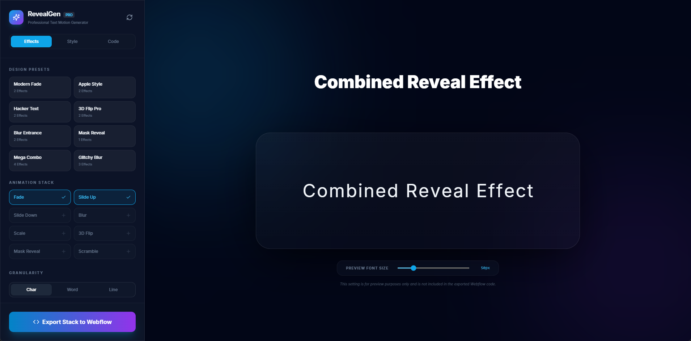

# RevealGen PRO 🚀
### Professional Text Motion Generator for Webflow

RevealGen PRO is a powerful, web-based tool designed to create high-performance text revelation animations. It allows designers and developers to stack multiple effects (Fade, Slide, Blur, Scale, 3D Flip, Scramble, etc.) and generate clean, production-ready code for Webflow or any web project.

 *(Note: Add a real screenshot here after hosting)*

## ✨ Features

- **Multi-Effect Stacking**: Combine Blur, Fade, Slide, and more in a single animation.
- **GSAP Optimization**: Automatic integration with GSAP for buttery smooth 60fps animations.
- **Granular Control**: Animate by character, word, or line.
- **Custom Stagger Flow**: Forward, Backward, From Center, or Randomized.
- **Webflow Ready**: Generates a single copy-paste snippet with CSS and JS.
- **Live Preview**: Real-time visualization of your animation as you tweak properties.
- **Smart Bleed Compensation**: Prevents blur clipping issues automatically.

## 🛠️ Tech Stack

- **Framework**: React 19 + TypeScript
- **Bundler**: Vite
- **Styling**: Tailwind CSS
- **Animations**: Framer Motion (Preview) & GSAP (Export)
- **Icons**: Lucide React

## 🚀 Getting Started

### Local Development

1. **Clone the repository**:
   ```bash
   git clone https://github.com/your-username/revealgen-pro.git
   ```

2. **Install dependencies**:
   ```bash
   npm install
   ```

3. **Run the dev server**:
   ```bash
   npm run dev
   ```

### Deployment

This project is optimized for deployment on **Vercel**, **Netlify**, or **GitHub Pages**.

1. Connect your GitHub repository to Vercel/Netlify.
2. Build Command: `npm run build`
3. Output Directory: `dist`

## 📝 Usage for Webflow

1. Open RevealGen PRO and design your effect.
2. Click **"Export Stack to Webflow"**.
3. In Webflow, add a **Custom Code Embed** on your page.
4. Paste the code.
5. Ensure the element you want to animate has the class specified in the "Webflow Target Class" field (default: `reveal-element`).

## 📄 License

MIT License - feel free to use it for personal or commercial projects!
